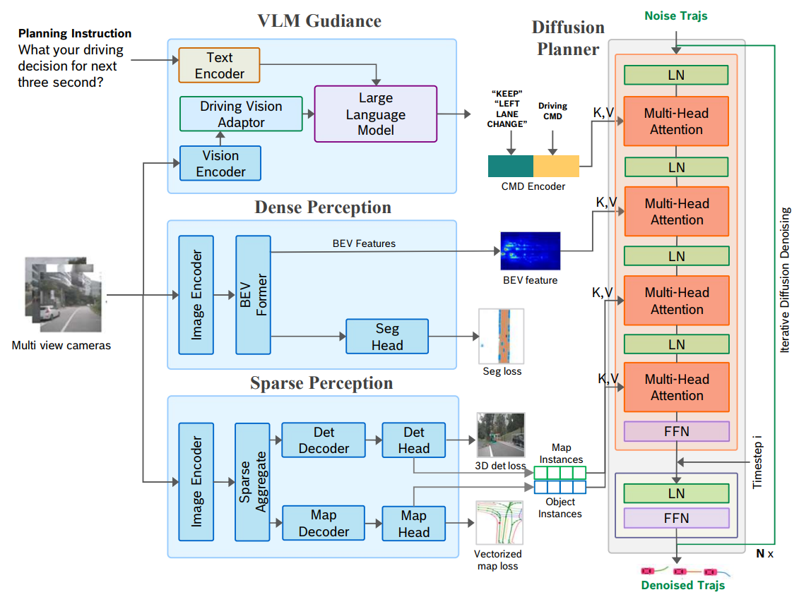
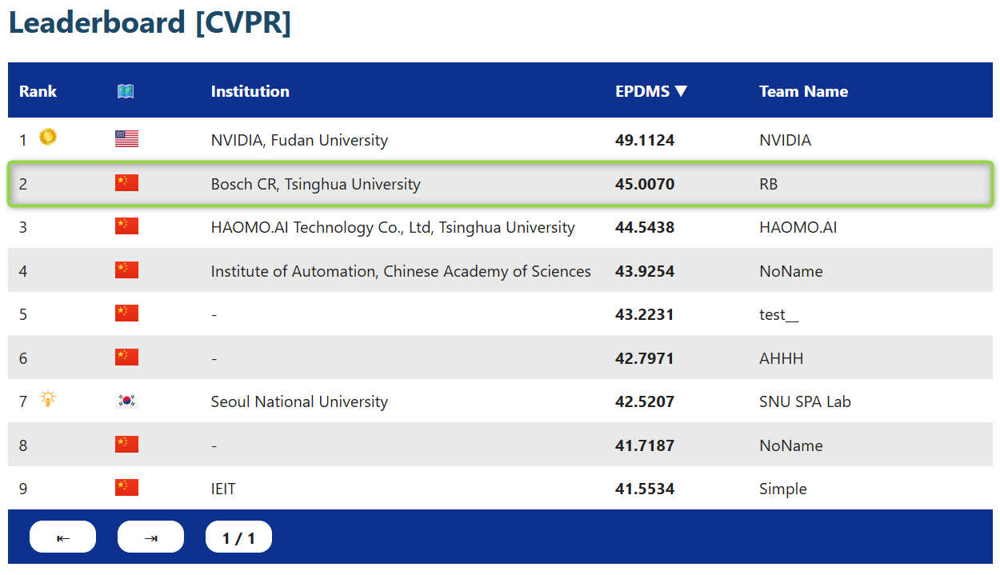

  
  

  <h2 align="center">DiffVLA: Vision-Language Guided Diffusion Planning for Autonomous Driving</h2>

  <h3 align="center">
    <a href="https://arxiv.org/abs/2505.19381">[Paper]</a> |
    <a href="https://github.com/autonomousvision/navsim">[Base: NAVSIM Repository]</a>
  </h3>

  

    DiffVLA builds upon <a href="https://github.com/autonomousvision/navsim">NAVSIM</a> to enable
    diffusion-driven end-to-end policy learning for language-conditioned autonomous driving.
     
    This repository integrates pseudo-simulation from NAVSIM with diffusion-based trajectory generation.
  

  

    We are keep working on E2E models and we will keep update the latest work list here: 
     
    <a href="https://arxiv.org/abs/2509.14303">[FlowDrive: Energy Flow Field for End-to-End Autonomous Driving]</a> |
    <a href="https://arxiv.org/abs/2508.06571">[IRL-VLA: Training an Vision-Language-Action Policy via Reward World Model]</a> |
  

 

---

## 📘 Documentation

# 🧭 How to Use DiffVLA
This guide explains how to set up and configure the **DiffVLA** module inside the NAVSIM framework.
---

The image backbone is from https://github.com/youngwanLEE/vovnet-detectron2
Please download the weights of VoV99 net in the upper repo.

## ⚙️ 1. Configuration 
Please update the following parameters in

`navsim/agents/diffvla/diffvla_config.py`:

| Parameter | Description |
|------------|--------------|

|  `pdm_pkl_path`  | Path to your PDM GT files. |

|  `num_voc`  | Different number of trajectory vocabs. |

|  `plan_anchor_path`  | Path to the anchor files used for trajectory planning. |

|  `with_vlm`  | Define with or without meta action cmd from VLM. |

**Example:**

pdm_file_path = "diffvla_data_exp/pdm_scores_8192"
num_voc = 8192
plan_anchor_path = "diffvla_data_exp/planning_vb/trajectory_anchors_8192.npy"
with_vlm = True

## 🚗 2. Trajectory Head
In the new version, the trajectory head has been replaced with a reward-based transformer head.

Please ensure that:

The active trajectory head is switched to
navsim/agents/diffvla/trajectory_head_reward.py

The model definition file
navsim/agents/diffvla/transfuser_model.py
has been updated to use the transformer-based trajectory head.

## 🧩 3. Notes
Make sure all paths in configuration files are absolute or relative to the project root.

Cached or generated training data should be excluded via .gitignore.

## 🧪 4. (Optional) Training and Evaluation
Below is a recommended structure to extend this guide later:

### 🏋️ Training
Run the following command to define env, cache dataset and start training:

bash diffvla_env.sh 
bash cache_dataset_diffvla.sh
bash train_diffvla.sh

Edit train_diffvla.sh to the specify dataset cache path, GPUs, and hyperparameters. For 8 * H20 (Chinese limited edition of H100 which is more than 2 times slower than H100) GPUs , the training will takes 45min*30 to finish. 

### 🔍 Evaluation
To evaluate the agent, one must create metric cache 1st.
Run the cache script:

bash metric_cache.sh

You can define your interested data set for evaluation such as navtest or navhard two stage. The default is set to navhard two stage.

We offer a fast evaluation script to test the model duo to the original test scripts from NAVSIM are too slow (30 min vs 2 hour).

Run the evaluation script:

bash fast_test.sh

Edit fast_test.sh to the specific CACHE_PATH, CKPT, EXP_NAME, EXP_ID and AGENT 

Evaluation results will be saved in the results/ directory by default.

Please notice that the fast test script will have EPDM scores slightly differ from the original evaluation script the difference related scores between official evaluation scirpt and the fast test script is less than 0.25%.

## 🚀 5. Notifications
The released version has some modifications compared to the paper on arXiv:
1. The trajectory head has been updated from Diffusion Drive to a self-developed Transformer-based Trajectory Head.
2. A reward loss derived from multiple EPDM sub-metrics has been introduced to guide training.

## 🔧 6. Generate EPDM Scores for Training
The current DiffVLA training requires EPDM scores for the trajectory vocabulary defined in your model.
We provide a Python script to generate EPDM scores and save them as .pkl files (named with tokens for each training sample).

Run:
python navsim/misc/gen_multi_trajs_pdm_score_ours.py

### ⚠️ Note: This script is experimental and may require manual adjustment.
Please update parameters inside navsim/misc/gen_multi_trajs_pdm_score_ours.py, such as metric cache paths, output directories, and vocabulary file paths.
